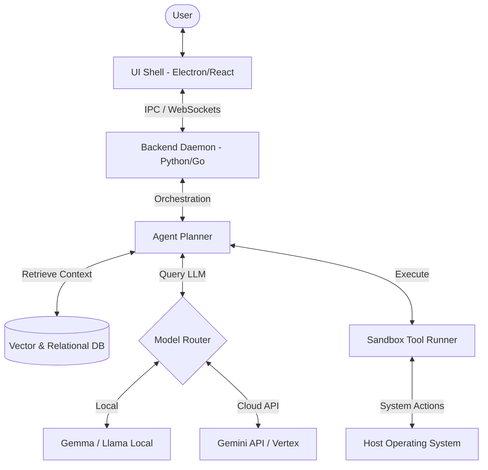

# JARVIS-X Master Specification (SRS)

**Document Version:** 1.0.0-draft  
**Last Updated:** 2026-07-23  
**Status:** Draft  
**Target System:** JARVIS-X System Ecosystem  

---

## 1. Executive Summary
JARVIS-X is an advanced, autonomous desktop assistant and productivity coordinator designed to act as an intelligent, context-aware interface between users and their computing environments. Unlike traditional passive command-line or GUI assistants, JARVIS-X proactively orchestrates system automation, manages persistent memory states, processes multi-modal sensory inputs (voice, vision), and executes complex task workflows with minimal user intervention. It is designed to run local-first while maintaining the capability to coordinate with cloud-based intelligence layers.

---

## 2. Vision Statement
To transition human-computer interaction from a manual command-and-control paradigm to an intent-driven, collaborative relationship. JARVIS-X envisions a future where the operating system and applications are seamlessly unified by an omnipresent, highly secure, and deeply personalized digital coordinator that understands user context, anticipates needs, and handles routine digital overhead automatically.

---

## 3. Mission Statement
To engineer a secure, highly responsive, and robust open ecosystem for desktop automation and context retrieval. We aim to achieve this by combining state-of-the-art Large Language Model (LLM) reasoning with real-time desktop perception, deterministic system tools, and a secure plugin architecture, allowing developers and users to extend capability without sacrificing security or privacy.

---

## 4. Product Philosophy
*   **Invisible Control, Absolute Utility:** The assistant should run unobtrusively in the background, intervening only when requested or when highly confidence-based proactive alerts are warranted.
*   **Context is King:** System actions are only as good as the context they are executed in. JARVIS-X prioritizes deep situational awareness over raw model size.
*   **Security by Default:** Since the agent interacts directly with the user's filesystem, applications, and sensory hardware (microphone/camera), sandboxing and explicit permissions are non-negotiable foundations.
*   **User in the Loop:** Autonomous actions must respect a spectrum of user-defined agency, ranging from strict verification requirements for high-risk actions to complete autonomy for safe tasks.

---

## 5. Core Principles
1.  **Local-First Processing:** Keep user data, context databases, and core scheduling on the local host to ensure privacy, reliability, and offline capability.
2.  **Determinism in Action:** While model reasoning is probabilistic, the execution of tools (terminal commands, file writes, API requests) must be deterministic and verifiable.
3.  **Low-Latency Feedback loops:** Minimize the time between sensory input (voice/vision), plan generation, and action execution to maintain flow state.
4.  **Extensibility:** Provide a clean, unified plugin API that isolates custom extensions while allowing them to interact securely with the core agent pipeline.

---

## 6. Design Principles
*   **High Visual Polish & Clarity:** The user interface must employ a modern design system using vibrant dark modes, sleek typography (e.g., Inter, Outfit), smooth CSS transitions, and micro-animations to convey state and action execution.
*   **Contextual Overlays:** Use non-disruptive, glassmorphic HUD (Heads-Up Display) overlays to show active agent actions, pending confirmations, and real-time audio waveforms.
*   **Multi-Modal Fluidity:** Users must be able to switch dynamically between typing, voice input, and screen-pointing interfaces without resetting the session state.
*   **State Transparency:** Always clearly display what the agent is "thinking," "viewing," and "doing" at any given second, preventing the black-box feeling.

---

## 7. Engineering Principles
*   **Strict Type Safety:** All system boundaries, IPC messages, and configurations must be strictly typed (e.g., using TypeScript interfaces, Pydantic models, or strict Go structures).
*   **Modular Component Isolation:** The codebase must isolate the sensory pipeline, memory retrieval systems, model endpoints, and system tools into distinct, decoupled packages.
*   **Comprehensive Instrumentation:** Every agent step, tool call, model invocation, and error must be systematically logged with correlation IDs for post-execution tracing.
*   **Fail-Safe Design:** Any failure in third-party integrations, local model execution, or custom plugins must fail gracefully without bringing down the core scheduler or exposing vulnerability boundaries.

---

## 8. Long-Term Goals
*   **Platform Maturity:** Complete, uniform feature parity across Windows, macOS, and Linux systems.
*   **Fully Offline Operation:** The ability to execute complex reasoning, planning, voice synthesis, and vision processing using entirely local models running on consumer-grade hardware.
*   **Self-Improving Workflows:** The system learns user habits over time, automatically suggesting and creating custom scripts or macros using local reinforcement loops.
*   **Agent-to-Agent Protocols:** Standardize secure negotiation protocols allowing a user's local JARVIS-X instance to interact directly with other agents to schedule meetings, transfer data, or coordinate tasks.

---

## 9. Non-Goals
*   **No Operating System Replacement:** JARVIS-X does not aim to replace the host OS, but rather to interact with existing OS interfaces (Win32/COM, AppleScript, DBus).
*   **No Centralized Cloud Monolith:** JARVIS-X will not store user session data, personal vector databases, or credentials on centralized cloud infrastructure.
*   **No IDE/Development Environment Replacement:** JARVIS-X does not replace specialized tools (like VS Code, Git, or compilers) but coordinates their execution.
*   **No Unbounded Autonomy:** JARVIS-X will not perform financial transactions, public data deletion, or external deployments without explicit, multi-factor user confirmation.

---

## 10. Target Users
*   **Software Engineers & Developers:** Users who require deep command-line coordination, automated code editing, environment setup, and script execution.
*   **Power Users & System Administrators:** Users managing complex multi-application workflows, batch file processing, and local database coordination.
*   **Knowledge Workers:** Professionals seeking to streamline meeting notes, document search, scheduling, and local workspace organization.
*   **Accessibility-Minded Users:** Individuals who benefit from advanced voice navigation, real-time screen visual description, and automated UI interactions.

---

## 11. Product Scope
The boundaries of the JARVIS-X system encompass:
*   **Sensory Capture:** Microphone streams, audio output streams, screen frame grabbers, and active window layout trees.
*   **System Action Layers:** Command execution sandboxes, local filesystem managers, keyboard/mouse event simulators, and active process inspectors.
*   **Memory Storage:** Local vector stores for semantic search, relational databases for structural system logs, and in-memory caches for immediate session state.
*   **UI/UX Shell:** System tray overlays, interactive configuration panels, floating action centers, and workspace dashboards.

---

## 12. Functional Requirements
*   **FR-1: Multi-Modal Command Processing:** The system must accept inputs via voice (live audio stream), text (CLI or chat window), and vision (screen capture/active window analysis).
*   **FR-2: Dynamic Intent Parsing:** The orchestrator must parse unstructured inputs into structured, step-by-step execution plans consisting of defined tool invocations.
*   **FR-3: Memory and Context Retrieval:** The system must automatically fetch relevant long-term memory (past user preferences, previous scripts) and short-term memory (open documents, recent commands) before presenting context to the LLM.
*   **FR-4: Sandboxed Tool Execution:** Tools that modify system states (e.g., executing powershell/bash scripts, writing files) must execute in an isolated environment with user-configurable permission prompts.
*   **FR-5: Lifecycle and Plugin Management:** Users must be able to install, update, disable, and audits plugins, which run in restricted virtual environments.
*   **FR-6: Session Serialization:** Ability to save, export, and resume full conversation and execution histories.

---

## 13. Non-Functional Requirements
*   **NFR-1: Latency:** The visual interface must render at 60 FPS. Local model routing and step planning must initiate within 350ms of input completion.
*   **NFR-2: Security:** All sensitive data (API keys, passwords, database connections) must be stored in the host system's secure credential manager (e.g., Windows Credential Manager, macOS Keychain). File modifications must prevent directory traversal outside specified workspaces.
*   **NFR-3: Reliability:** The execution engine must implement automatic retry logic with exponential backoff for network-dependent APIs. The system crash rate must be below 0.1% of active hours.
*   **NFR-4: Resource Utilization:** The background daemon must consume less than 150MB of RAM and 1% of CPU capacity when in idle/monitoring states.
*   **NFR-5: Accessibility:** The user interface must conform to WCAG 2.1 AA standards, supporting screen readers, keyboard navigation, and high-contrast styling.

---

## 14. Success Metrics
*   **Task Success Rate (TSR):** Percentage of agent plans executed to completion without errors or user cancellation. (Target: >85% for multi-step workflows).
*   **Response Time (RT):** Average time taken from user query input to initial action execution or response text generation. (Target: <1.5 seconds for cloud models, <0.8 seconds for local models).
*   **User Correction Frequency (UCF):** Number of times a user must modify or reject an agent's suggested plan per active session. (Target: <0.2 corrections per query).
*   **Active Retention Rate:** The ratio of daily active users to monthly active users (DAU/MAU).

---

## 15. Risks
*   **Security Exploits:** Malicious third-party inputs (e.g., prompt injection in web pages read by the agent) could lead to unauthorized system commands or file exfiltration.
*   **Model Hallucination:** The agent may generate syntactically valid but logically destructive system commands (e.g., incorrect directory deletions).
*   **State Out-of-Sync:** The agent acts based on a cached representation of the OS state, which may change independently due to manual user interaction during execution.
*   **API Cost Inflation:** Over-reliance on commercial cloud APIs could lead to unpredictable billing issues for developers and users.

---

## 16. Constraints
*   **OS Dependency Limitations:** Desktop APIs differ significantly between Windows (Win32, Registry), macOS (Applescript, Accessibility Permissions), and Linux (X11/Wayland, DBus), necessitating complex translation layers.
*   **Hardware Barriers:** High-performance local inference requires modern GPUs (NVIDIA CUDA, Apple Silicon Unified Memory) which may not be present on standard office machines.
*   **API Sandboxing Limits:** Host operating systems strictly regulate programmatic access to screen contents and audio capture, requiring explicit user setup of OS accessibility permissions.

---

## 17. Development Strategy
*   **Iterative Core Build:** Construct the core event loop, IPC framework, and tool sandboxing modules before integrating advanced models or sensory pipelines.
*   **Test-Driven Development (TDD):** Implement automated unit tests for all core system tools, mocking model outputs to ensure logic consistency.
*   **Continuous Integration (CI):** Every push to main branches must run multi-platform test suites (Windows, Linux, macOS containers) to verify path parsing and permission boundaries.
*   **Dogfooding Program:** Deploy pre-alpha releases to internal developer machines to accumulate real-world telemetry logs and trace runtime errors.

---

## 18. Versioning Strategy
JARVIS-X follows **Semantic Versioning 2.0.0 (SemVer)**:
*   **MAJOR version:** Incremented when there are incompatible API changes in the plugin framework, database schema migrations requiring manual reset, or fundamental core changes.
*   **MINOR version:** Incremented when functionality is added in a backwards-compatible manner (e.g., new built-in tools, new sensory pipelines, or updated models).
*   **PATCH version:** Incremented for backwards-compatible bug fixes, performance optimizations, and documentation updates.

---

## 19. Documentation Standards
*   **Self-Documenting Code:** Codebases must contain full JSDoc/Sphinx docstrings for all exposed modules and utilities.
*   **API Specifications:** All internal REST or WebSocket APIs must be defined using OpenAPI (Swagger) specifications.
*   **Architecture Diagrams:** Flowcharts and sequence diagrams must be maintained using [Mermaid.js](https://mermaid.js.org/) directly within the markdown documentation.
*   **Directory Readmes:** Every subfolder under the `/Specifications` path must maintain an active `README.md` defining its module name, purpose, scope, and dependencies.

---

## 20. Coding Standards Overview
*   **Frontend (UI):** ESNext syntax, TypeScript with strict null checks, ESLint configuration matching Airbnb style guidelines, and styling restricted to variables-based CSS.
*   **Backend (Service):** Python 3.11+ using strict type annotations, Black code formatting, Pytest for unit testing, and Pydantic for validation. Or Go 1.21+ using standard fmt and golangci-lint.
*   **Error Handling:** Never swallow exceptions. Every catch block must log the stack trace and return a structured Error object detailing the context, component, and resolution tip.

---

## 21. Architecture Overview

The architecture employs a separate UI shell running on Electron/React that communicates via secure IPC/WebSockets with a persistent backend service daemon. The daemon houses the state machine, memory engines, and tool execution boundaries.

---

## 22. AI Vision
JARVIS-X leverages a tiered hybrid model topology:
*   **Tier 1: Routing & Classification (Local):** Extremely lightweight local models (e.g., 2B to 7B parameters) classify user intents, extract immediate entities, and perform safety filtering.
*   **Tier 2: Complex Action Planning (Hybrid):** When internet connectivity is active, queries are routed to advanced cloud LLMs (such as Gemini 1.5 Pro) to resolve complex, nested, or multi-step logic.
*   **Tier 3: Vision & Multi-Modal Processing (Hybrid):** Capture streams utilize local vision encoders (e.g., SigLIP) to locate bounding boxes on screen, falling back to cloud-hosted multi-modal models for deep document layout analysis.

---

## 23. Future Expansion
*   **Decentralized Coordination (P2P):** Enabling direct machine-to-machine assistance without external internet hubs.
*   **Hardware Interface (Wearables):** Offloading audio synthesis and microphone listening to smart rings, earpieces, or secondary displays.
*   **Virtual OS Instances:** Run actions in temporary, completely virtualized OS layers (e.g., micro-VMs) to allow zero-risk execution of untested shell commands.

---

## 24. Glossary
*   **Agent Planner:** The core algorithm that loops through user input, generates reasoning steps, issues tool commands, parses outputs, and returns final results.
*   **IPC (Inter-Process Communication):** The mechanism enabling the separate frontend window process and backend service daemon process to pass structural messages.
*   **Local-First:** A design paradigm where application logic and data storage reside on the user's local machine, operating correctly without cloud dependencies.
*   **Prompt Injection:** A vulnerability where untrusted data (such as web text or files) overrides the system prompt guidelines to execute unauthorized instructions.
*   **Sensory Pipeline:** The continuous capturing, formatting, and forwarding of microphone audio input and screen capture frames to processing units.
*   **Tool Runner:** The system submodule that executes validated operating system-level commands, isolated from direct model manipulation.
*   **Vector Database:** A database optimized for storing and querying multi-dimensional numerical embeddings to perform fast semantic searches.
