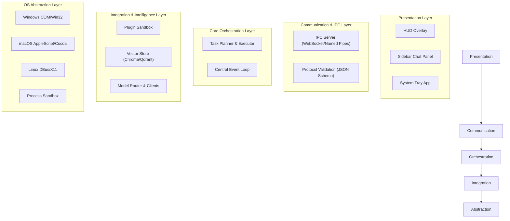
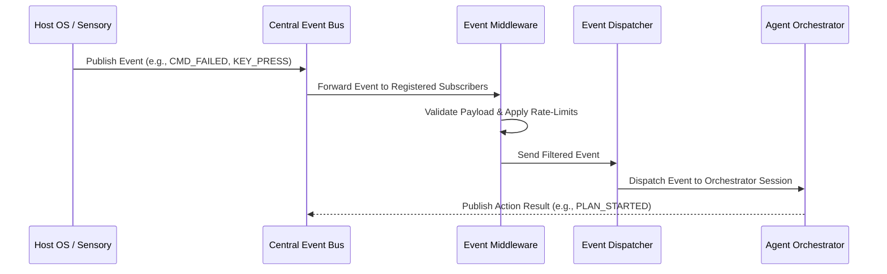
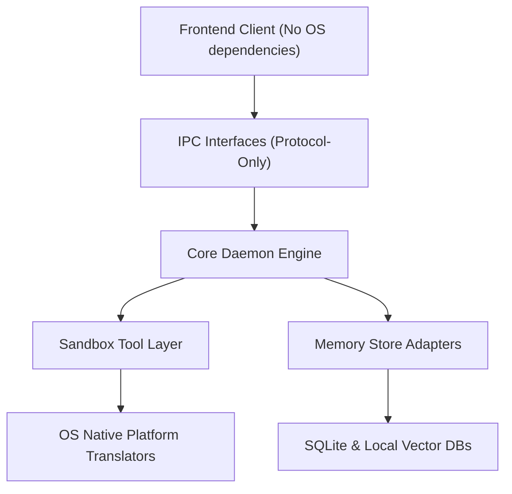
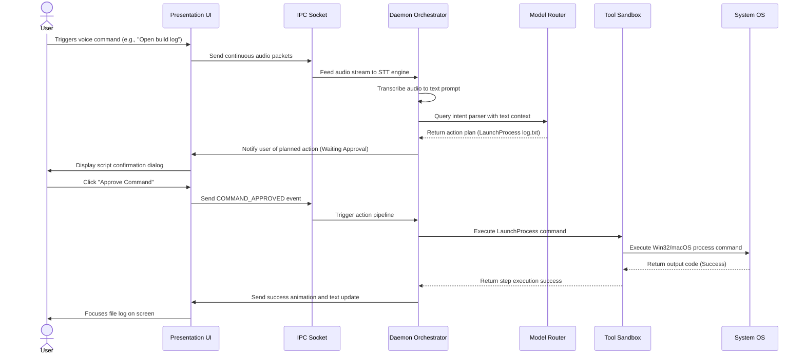
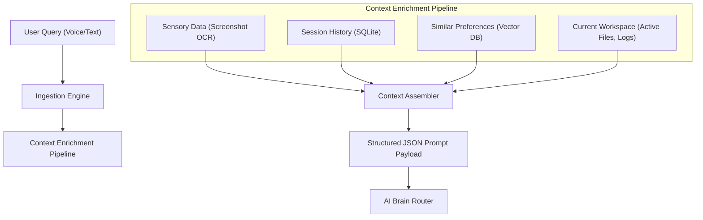

# JARVIS-X System Architecture Specification

**Document Version:** 1.0.0-draft  
**Last Updated:** 2026-07-23  
**Status:** Draft  
**Target System:** JARVIS-X Host Daemon and Client Environment  

---

## 1. Architecture Goals
The core objective of the JARVIS-X architecture is to construct a resilient, low-latency, and modular host system that seamlessly translates non-deterministic user intentions into deterministic system actions. The goals are:
*   **Privacy-First Localization:** Minimize network egress by defaulting to local storage, processing, and context indexing.
*   **Action Isolation & Security:** Establish immutable boundaries between LLM command generation and the target OS.
*   **Minimal Footprint:** Ensure background sensory pipelines and monitoring loops operate with negligible system overhead.
*   **Universal Platform Abstraction:** Decouple OS-specific integrations (Win32, COM, DBus, Cocoa) from the core planning engine.

---

## 2. Architecture Principles
*   **Uni-Directional Data Flow:** Ensure system state mutations flow through a single event pipeline to prevent race conditions.
*   **Probabilistic vs. Deterministic Separation:** AI brains reason, plan, and format interfaces probabilistically. The core scheduler compiles, runs, and monitors tools deterministically.
*   **Zero-Trust Subsystems:** Treat all incoming visual captures, terminal files, and external plugin payloads as untrusted.
*   **Modular Extensibility:** System functionality must be composed of loosely coupled services that communicate over defined APIs or event buses, rather than direct package coupling.

---

## 3. High-Level System Overview
JARVIS-X is structured as a client-daemon architecture. The frontend application handles sensory rendering, overlay HUDs, and conversational input. The backend daemon functions as the OS-level controller, housing the planning engine, vector memory, execution sandbox, and event loop.

```mermaid
graph TD
    User([User]) <-->|Visual/Voice/Text| UI["Presentation Layer (UI Shell & HUD)"]
    UI <-->|IPC/WebSocket (Strict JSON)| Daemon["Backend Core Daemon"]
    
    subgraph Daemon [Backend Core Daemon]
        Orch["Agent Orchestration Engine"]
        Bus["Event Bus"]
        Plugin["Plugin Container"]
        Mem["Memory Manager"]
        Sensory["Sensory Processor"]
        Sandbox["Tool Sandbox Runner"]
        
        Orch <--> Bus
        Orch <--> Plugin
        Orch <--> Mem
        Orch <--> Sandbox
        Sensory --> Bus
    end

    Daemon <-->|REST/gRPC| BrainRouter{"AI Brain Router"}
    
    subgraph BrainRouter
        Local["Local Inference (Gemma/Llama)"]
        Cloud["Cloud API (Gemini Pro/Vertex)"]
    end
    
    Sandbox <-->|Native API Calls| OS["Host OS (Windows/macOS/Linux)"]
```

---

## 4. System Layers
JARVIS-X organizes system components into five distinct vertical layers. Each layer may only import or communicate with the layer immediately below it or via the event bus.



---

## 5. Frontend Architecture
The Frontend layer is a lightweight, low-footprint client shell built using modern UI technology. It is designed to render floating transparent layouts (glassmorphism) and run visual overlays directly on top of active system windows.
*   **Rendering Architecture:** Single-page app using virtual DOM rendering. Restricted to pure vanilla CSS styling to maximize rendering speeds and eliminate heavy styling build matrices.
*   **State Management:** Reactive local state store that manages dialogue history, pending system commands, and sensor statuses (e.g., active listening visualizer).
*   **Process Isolation:** The UI runs in a non-privileged shell. It has zero capability to interact with the host OS filesystem or terminal directly; all native commands must be forwarded to the Daemon via the IPC layer.

---

## 6. Backend Architecture
The Backend operates as a persistent system daemon, running as a background service. It acts as the coordinator of all integrations, task planners, and terminal controllers.
*   **State Machine:** A deterministic state machine managing transition states: `IDLE` -> `RECORDING` -> `PLANNING` -> `AWAITING_APPROVAL` -> `EXECUTING` -> `VERIFYING` -> `IDLE`.
*   **Multi-Threading & Async Execution:** Utilizes asynchronous event frameworks to perform non-blocking I/O operations (such as listening for keyboard hotkeys and watching directory trees) while processing complex multi-step plans in separate execution threads.

---

## 7. AI Brain Architecture
The AI Brain architecture coordinates model communication and decouples downstream modules from specific model endpoints.
*   **Model Router:** Dynamically routes prompts to either the local inference engine (for low-latency routing or offline operation) or cloud LLM endpoints (for high-reasoning tasks).
*   **Context Assembler:** Gathers short-term variables (active editor files, compiler exit codes), long-term database context (user style preferences), and sensory inputs into structured, token-optimized system prompt templates.
*   **Format Constraints:** Enforces strict structural boundaries on LLM outputs (such as JSON schemas or markdown formats) using client-side validation libraries to ensure tool parameters match deterministic function calls.

---

## 8. Memory Architecture
Memory is divided into three functional horizons to support context retrieval:
1.  **Transient Memory:** In-memory session log containing the active dialog tree, recent tool outputs, and user corrections.
2.  **Episodic Memory:** SQLite database recording historical tasks, execution logs, and script files generated by the system.
3.  **Semantic Memory:** Local Vector Database (e.g., ChromaDB/Qdrant) storing embeddings of documentation, user workflow histories, and recurring configuration setups. Semantic queries calculate cosine similarity to enrich the prompt context.

---

## 9. Voice Architecture
The voice sensory pipeline converts continuous raw microphone streams into discrete, actionable text:
*   **Ingestion Pipeline:** Captured PCM audio streams are chunked and analyzed locally using voice activity detection (VAD) algorithms.
*   **Transcription Node (STT):** High-efficiency speech-to-text models (local Whisper implementations or cloud streaming APIs) convert voice chunks into text.
*   **Text-to-Speech Engine (TTS):** Generates natural-sounding speech responses for hands-free interactions, using local system speech APIs or premium synthetic voice generators.

---

## 10. Vision Architecture
The vision pipeline handles the interpretation of visual context on the user's desktop:
*   **Frame Grabber:** On-demand capturing of user-designated screen regions or active window bounding coordinates.
*   **Visual Encoder:** Converts image blocks into embeddings or compressed files. It performs OCR (Optical Character Recognition) to extract window text and bounding boxes for UI components.
*   **Context Matcher:** Matches visual coordinates to the operating system's window layouts, translating click coordinates into real OS application triggers.

---

## 11. Desktop Automation Architecture
This module translates the structured steps generated by the Agent Planner into actual system mutations:
*   **Automation Driver Interface:** System interface exposing standard commands: `PressKey`, `ClickCoordinate`, `GetActiveWindow`, `LaunchProcess`, `OpenFile`, `WriteFile`.
*   **OS Translators:** OS-specific modules implementing the Driver Interface:
    *   *Windows:* ctypes accessing Win32 APIs, COM wrappers for application automation.
    *   *macOS:* PyObjC accessing AppleScript commands and UI accessibility attributes.
    *   *Linux:* python-dbus and python-xlib interfaces.
*   **Command Isolation:** Automation execution loops reside in a low-privilege subprocess, preventing runaway loops from locking the primary daemon thread.

---

## 12. Agent Architecture
The Agent architecture governs reasoning loops and verification procedures:
*   **Orchestrator:** Loops through the planning flow: Analyze Input -> Query Brain -> Generate Step List -> Execute Safe Steps -> Prompt for Warning/Critical Steps -> Verify Step Results -> Complete.
*   **Self-Correction System:** If a step execution fails (e.g., compile error, missing directory), the execution loop appends the error trace to the context, asks the brain for a corrective plan, and re-executes.
*   **Execution Checker:** Validates generated plans against security blacklists (e.g., `rm -rf /` or registry modifications) before execution.

---

## 13. Plugin Architecture
Plugins enable modular expansion of the tool pipeline:
*   **Plugin Sandbox:** Third-party plugins execute in isolated runtimes (e.g., WASM sandboxes or virtual environment subprocesses) with restricted filesystem permissions.
*   **Plugin Lifecycle Manager:** Handles discovery, loading, health-checking, and deletion of plugins.
*   **Capability Registry:** A central register documenting all tools exposed by active plugins. When a new plugin is enabled, its tools are dynamically injected into the Brain router's list of executable system options.

---

## 14. Event Bus Architecture
Communication inside the daemon is decoupled through a central Event Bus using the Publish-Subscribe pattern.



---

## 15. Configuration Architecture
*   **Storage Pattern:** Settings are saved in a structured JSON schema in the user's AppData directory (e.g., `~/.gemini/antigravity-ide/config/mcp.config.json`).
*   **Dynamic Reloading:** File watchers monitor changes to configuration files, reloading variables in real-time without restarting background daemons.
*   **Encryption Layer:** Sensitive configurations, such as cloud API keys, are stored directly in platform-specific secure vaults (Keychain/Credential Manager) and are never written to plaintext settings files.

---

## 16. Security Architecture
The security architecture operates on the principle of least privilege:
*   **Action Classification:** Tools are strictly classified into categories:
    *   `SAFE` (e.g., read file inside workspace, list window titles) -> Execute immediately.
    *   `WARNING` (e.g., write file, launch external process) -> Execute with light visual notification.
    *   `CRITICAL` (e.g., delete directory, execute raw shell commands, modify network ports) -> Block execution until explicit user verification via HUD confirmation prompt.
*   **Workspace Anchoring:** All file operations verify target paths to ensure directory targets remain within the user's configured workspace directory, preventing directory traversal attacks.

---

## 17. Database Architecture
*   **Relational DB (SQLite):** Serves as the transactional store for dialogue session state, tool call execution logs, and configuration schema mapping. Chosen for its zero-dependency local operation.
*   **Vector DB (Chroma/Qdrant):** Handles similarity-search indexing. Embeds user command history and script snippets. Data is stored in persistent local directories and queried locally.

---

## 18. Logging Architecture
*   **Structured Logs:** All modules output logs in standardized JSON format containing fields: `timestamp`, `level`, `component`, `correlation_id`, and `message`.
*   **Correlation Tracing:** An entry request generates a unique `Correlation-ID` that propagates through the IPC layer, Event Bus, Agent Planner, and Tool Sandbox, allowing full execution trees to be audited during debug sessions.
*   **Log Retention:** Logs are rotated daily and capped at 50MB, preventing local system storage exhaustion.

---

## 19. Monitoring Architecture
*   **Heartbeat Monitor:** A dedicated background thread registers periodic check-ins from the UI process, backend core, and sensory capture pipelines.
*   **Resource Monitor:** Collects memory usage, CPU capacity, and GPU VRAM usage. If limits are exceeded (e.g., memory leak or run-away compiler subprocess), it triggers recovery safeguards to kill offending processes.
*   **Inference Costs Monitor:** Tracks total tokens consumed from cloud API engines, reporting usage and estimating costs in the settings overlay.

---

## 20. Deployment Architecture
JARVIS-X is packaged as a local desktop installer bundle:
*   **Windows Package:** Standard MSI wrapper installing the UI client and packing the backend daemon executables as background services.
*   **macOS Package:** Standard DMG file wrapping the client App and embedding the daemon binaries. Requires onboarding prompts for accessibility and microphone permissions.
*   **Local Auto-Updates:** A secure update manager polls release repositories, downloads cryptographic signatures, validates releases, and updates local binaries in the background.

---

## 21. Scalability Strategy
While running locally, scalability focuses on maximizing efficiency within host resource limits:
*   **Model Downscaling:** Dynamically shifts context loads or switches to smaller quantized models (e.g., from 7B to 2B parameters) when local CPU/GPU loads spike.
*   **Thread Pooling:** Pre-allocates worker threads for running scripts and processing media, preventing thread context-switching overhead from freezing the UI window.

---

## 22. Fault Tolerance
*   **Self-Healing Daemon:** If the backend core daemon crashes, the UI shell detects connection failure on the IPC socket and automatically launches a new backend daemon process, restoring the session state from episodic databases.
*   **Graceful API Fallbacks:** If a cloud model API rate limit is exceeded, the router automatically switches to local model inference or queue requests with user notifications.
*   **State Purging:** In the event of system database corruption, the configuration manager performs an automatic schema reset, restoring settings from secure backups.

---

## 23. Performance Strategy
*   **Shared Memory Buffers:** Media frames captured from the screen pipeline are written directly to memory-mapped files or shared buffers, avoiding heavy copy operations.
*   **Prompt Caching:** Systems cache base system prompts and historical context arrays within the LLM client engine, reducing target model processing overhead.
*   **Debounced Sensory Signals:** Event listeners throttle continuous inputs (such as cursor movements or volume adjustments) to prevent the Event Bus from saturating.

---

## 24. Dependency Rules
JARVIS-X follows a strict clean-architecture import hierarchy:


*   **Rule 1:** Low-level OS platform translators must have no knowledge of the Agent Planner or dialogue states.
*   **Rule 2:** The Frontend UI shell must never import or link directly with database libraries or native system libraries.
*   **Rule 3:** The core planning loops communicate with models and platforms solely through abstracted interfaces, allowing plug-and-play replacement of models and platform wrappers.

---

## 25. Communication Flow


---

## 26. Module Boundaries
*   **`Presentation`:** Confined to rendering UI windows, overlays, styling states, and capturing keyboard/mouse movements.
*   **`Orchestration`:** Manages conversation trees, planning logic, self-correction runs, and coordinates other daemon sub-modules.
*   **`Sensory`:** Responsible for capturing audio streams, analyzing screen frame images, running VAD, and processing transcription results.
*   **`Tools`:** Contains independent, sandboxed tool definitions (filesystem interfaces, terminal executors, configuration managers).
*   **`Memory`:** Isolates database integrations, schema migrations, and vector similarity calculations.

---

## 27. Folder Responsibilities
```
/Specifications
  /00_Master      -> Core system specifications, terminology, and goals.
  /01_Product     -> Product Requirements Document (PRD) and User Personas.
  /02_Architecture -> Complete technical architecture, sequence diagrams, and ADRs.
  /03_UI          -> Interface mocks, styling guides, and visual workflow layouts.
  /04_Backend     -> Backend core system designs, states, and process boundaries.
  /05_AI          -> AI models integration, prompt templates, and routing rules.
  /06_Memory      -> Database schemas, vector store parameters, and caching methods.
  /07_Voice       -> STT, TTS configurations, and audio capture pipeline designs.
  /08_Vision      -> Screen grabbers, vision models, and OCR coordinate mapping.
  /09_Agents      -> Agent planning loops, checklists, and self-healing behaviors.
  /10_Automation  -> Platform automation interfaces (Win32, Cocoa, DBus).
  /11_Plugins     -> Plugin specifications, sandbox constraints, and API protocols.
  /12_Database    -> SQLite database rules and transaction details.
  /13_API         -> IPC protocols, WebSocket endpoints, and schema definitions.
  /14_Security    -> Authentication specifications, key stores, and sandbox blacklists.
  /15_Testing     -> Testing guidelines, QA pipelines, and mocking strategies.
  /16_Deployment  -> Packaging structures, auto-updates, and installer details.
  /17_Roadmap     -> Development milestones, releases, and phases.
  /18_Diagrams    -> Source diagrams files, mermaid files, and flow sheets.
  /19_Research    -> R&D findings, performance reports, and model comparisons.
```

---

## 28. Data Flow
This diagram illustrates the data aggregation process used to enrich prompts before they are dispatched to the AI brain router:



---

## 29. Future Expansion Strategy
*   **WASM Tool Standard:** Abstract all tools into WebAssembly targets, allowing sandboxed plugins to execute on any host platform without code modification.
*   **Encrypted Sync Layer:** Prepare database structures for end-to-end encrypted synchronization across user instances, using decentralized transport protocols (e.g., LibP2P).
*   **Virtual OS Sandboxing:** Build abstract bindings to virtual machine managers (such as Docker or Firecracker), enabling critical commands to run in disposable execution environments.

---

## 30. Architecture Decision Records (ADR)
### ADR-01: Use of SQLite + Local Vector Database for Memory
*   **Context:** JARVIS-X requires storing transactional dialogue history and performing fast semantic searches on user preferences and documentation.
*   **Decision:** We will use SQLite for relational logs and a local Vector Database (ChromaDB/Qdrant) for embeddings.
*   **Consequences:** Ensures zero cloud database dependencies, absolute user data privacy, rapid local data retrieval, and eliminates hosting/networking costs.

### ADR-02: Separate UI Shell and Background Daemon Process
*   **Context:** Running long-running system scripts or voice pipelines in the same process as the UI rendering code causes frame lag and potential UI locks.
*   **Decision:** Decouple the GUI application (Electron/native overlay) from the backend core service (Python/Go daemon), communicating via local IPC.
*   **Consequences:** Keeps the user interface responsive at 60 FPS even during heavy local AI inference or script execution, and allows the daemon to recover gracefully from UI crashes.

### ADR-03: Unified Driver Interface for OS Commands
*   **Context:** Cross-platform support requires writing custom OS commands (Win32, COM, AppleScript, DBus). Coupling these to the main Agent Planner introduces technical debt.
*   **Decision:** Implement an abstract Automation Driver interface, and restrict the Agent Orchestrator to invoking this interface, hiding OS-specific code inside platform translators.
*   **Consequences:** Simplifies adding support for new operating systems and makes debugging automation scripts easier through automated mocks.
