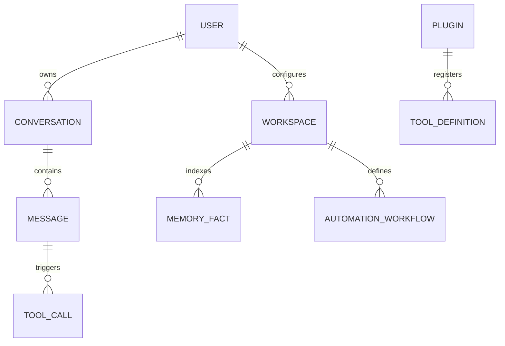

# JARVIS-X Database Architecture Specification

**Document Version:** 1.0.0-draft  
**Last Updated:** 2026-07-23  
**Status:** Active Draft  
**Target System:** JARVIS-X Persistent Data & Storage Subsystem  

---

## 1. Purpose
The Database Architecture defines the multi-tier storage engine of JARVIS-X. Unlike simple desktop software relying on static files or a single database file, an AI Operating System requires heterogeneous storage solutions: relational databases for transactional application state, vector databases for high-dimensional semantic memory embeddings, fast key-value caches for transient session context, and encrypted local file storage for large assets.

---

## 2. Vision
To establish a high-throughput, local-first, zero-leakage data layer that provides sub-millisecond retrieval performance for the AI Brain and Memory Engine. Inspired by Iron Man's JARVIS, which retains instant access to historical battle logs, suit diagnostics, and personal preferences, the Database Architecture ensures JARVIS-X securely organizes and indexes vast amounts of personal knowledge locally without compromising speed or privacy.

---

## 3. Design Principles
*   **Scalability:** Supports indexing millions of records, conversation turns, and vector embeddings without query latency degradation.
*   **Reliability:** ACID-compliant transactional guarantees for critical system logs, preferences, and task states.
*   **High Availability:** Local multi-threaded database connections ensuring sub-millisecond availability for core services.
*   **Security:** AES-256 encryption-at-rest for all local database files and credentials stored in native OS key vaults.
*   **Performance:** Strategic indexing, memory-mapped vector buffers, and query caching for sub-50ms hybrid context lookups.
*   **Modularity:** Clean repository abstractions decoupling database drivers from domain services.
*   **Extensibility:** Schema migration engines that allow smooth version upgrades without data loss.
*   **Data Integrity:** Foreign key enforcement, WAL logging, and automated integrity validation checks on startup.

---

## 4. Database Responsibilities
1.  **User Data & Preferences:** Storing user profiles, visual theme settings, and security policy rules.
2.  **AI Conversations & Threads:** Preserving structured dialogue histories, tool execution logs, and context snapshots.
3.  **Memory Storage:** Indexing short-term working state, episodic execution logs, and semantic knowledge facts.
4.  **Vector Embeddings:** Storing high-density numerical embeddings (e.g., 768/1536 dimensions) for similarity searches.
5.  **Configuration & Settings:** Managing dynamic application settings and plugin manifests.
6.  **Audit Logs:** Storing tamper-evident logs of tool calls, permission grants, and security events.
7.  **Analytics & Telemetry:** Tracking local performance metrics, cloud API token consumption, and model inference latency.
8.  **Plugin & Automation Data:** Retaining third-party plugin state tables, cron schedules, and workflow DAG definitions.

---

## 5. High-Level Database Architecture

Application services interact with specialized storage layers through a unified abstraction interface:

```
[ Application Services / Agent Engine ]
                   |
                   v
        [ 1. Database Manager ]
                   |
                   v
        [ 2. Repository Layer ] ---> (Abstract Interfaces: ITaskRepo, IMemoryRepo)
                   |
                   v
        [ 3. Database Router ]
                   |
  +----------------+----------------+----------------+----------------+
  |                |                |                |                |
  v                v                v                v                v
[ SQLite DB ]  [ Vector DB ]   [ Cache Layer ]  [ File Storage ] [ Secret Vault ]
(Relational)   (Chroma/Qdrant) (In-Memory RAM)  (Local Disks)    (OS Key Ring)
```

---

## 6. Database Types & Technology Selection

| Storage Type | Technology | Best Suited For | Advantages | Limitations |
| :--- | :--- | :--- | :--- | :--- |
| **Relational DB** | SQLite 3 (WAL Mode) | Transactional data, session logs, task DAGs, user settings | Zero setup, single-file, ACID compliant, fast local reads | Limited multi-writer concurrency |
| **Vector DB** | ChromaDB / Local Qdrant | High-dimensional embedding storage & semantic similarity | Sub-50ms nearest-neighbor vector search, native metadata filtering | Higher RAM consumption for large indices |
| **Cache Layer** | In-Memory Hash Map / LRU | Active dialogue context, hot configuration tokens | 0ms lookup latency | Volatile (cleared on reboot) |
| **File Storage** | OS Local Filesystem | Raw audio WAVs, screen frame images, document downloads | High throughput streaming for large files | Unstructured (requires DB pointers) |
| **Secret Vault** | OS Keychain / Credential Mgr | API keys, OAuth tokens, private passphrases | Hardware-backed security, OS native integration | Platform-specific API differences |

---

## 7. Data Models & Entity Relationships



### Core Entities
*   **`User`:** `id`, `name`, `theme_preference`, `security_policy_level`, `created_at`.
*   **`Conversation`:** `id`, `user_id`, `title`, `status`, `summary`, `created_at`, `updated_at`.
*   **`Message`:** `id`, `conversation_id`, `role` (user/assistant/tool), `content`, `tokens_used`, `timestamp`.
*   **`ToolCall`:** `id`, `message_id`, `tool_name`, `parameters_json`, `output_json`, `status`, `execution_time_ms`.
*   **`MemoryFact`:** `id`, `workspace_id`, `category`, `fact_text`, `importance_score`, `vector_id`, `last_accessed`.
*   **`AutomationWorkflow`:** `id`, `name`, `trigger_type`, `yaml_definition`, `enabled`, `last_run`.

---

## 8. Repository Layer
The Repository Pattern encapsulates database logic behind domain contracts:

```python
class IMemoryRepository(ABC):
    @abstractmethod
    async def add_fact(self, fact: MemoryFact) -> str: pass
    
    @abstractmethod
    async def search_semantic(self, vector: List[float], limit: int) -> List[MemoryFact]: pass

class SQLiteMemoryRepository(IMemoryRepository):
    def __init__(self, db_connection: AsyncConnection, vector_store: VectorStoreAdapter):
        self.db = db_connection
        self.vectors = vector_store
```

*   **CRUD Operations:** Clean async interface methods (`create`, `read_by_id`, `update`, `delete`).
*   **Transactions:** Explicit transaction wrappers (`async with db.transaction():`) ensuring multi-table consistency.

---

## 9. Vector Storage & Semantic Retrieval
*   **Embedding Schema:** Vectors stored with dimensions matching the active embedding model (e.g., 768 dimensions for `nomic-embed-text` or 1536 for OpenAI `text-embedding-3-small`).
*   **Index Algorithm:** HNSW (Hierarchical Navigable Small World) graphs for logarithmic vector search scaling.
*   **Metadata Filtering:** Vector queries filter by workspace, category, and recency constraints before similarity ranking:

```python
results = vector_store.query(
    query_vector=prompt_embedding,
    where={"workspace_id": active_workspace_id, "category": "coding_style"},
    top_k=5
)
```

---

## 10. Backup & Recovery
*   **Scheduled Backups:** Daily background export of relational databases to compressed SQLite dumps (`.sql.gz`).
*   **Incremental Vector Backups:** Snapshot exports of ChromaDB/Qdrant collection state files.
*   **Disaster Recovery:** If startup health checks detect database corruption, the system renames the corrupted file to `.corrupted` and automatically restores from the latest valid backup.

---

## 11. Performance Optimization
*   **SQLite WAL Mode:** Write-Ahead Logging (`PRAGMA journal_mode=WAL;`) allows concurrent reads while background writes occur.
*   **Strategic Indexing:** Indexes defined on high-frequency query paths (`conversation_id`, `workspace_id`, `timestamp`, `fact_category`).
*   **Connection Pooling:** Reuses SQLite connection handles to eliminate connection setup overhead.
*   **Prepared Statements:** Pre-compiled SQL queries prevent query parsing overhead and protect against SQL injection.

---

## 12. Security & Data Isolation
*   **Encryption at Rest:** SQLite database files encrypted using SQLCipher (AES-256).
*   **Credential Protection:** API keys and passwords are NEVER saved in SQLite or Vector DB files; they are stored strictly in the native OS Keyring.
*   **Sanitization Pipelines:** Pre-storage regex scrubbers scrub sensitive data (passwords, credit cards) before writing records to disk.

---

## 13. Scalability Strategy
*   **Partitioning by Workspace:** Separate vector collections per workspace path prevent cross-project search interference and keep vector indices small.
*   **Log Pruning & Archiving:** Task execution logs older than 90 days are automatically archived to compressed cold-storage files (`log_archive_YYYY.json.gz`).

---

## 14. Error Handling & Recovery
*   **Deadlock Prevention:** Single-writer queue for SQLite transactions eliminates database locked errors (`SQLITE_BUSY`).
*   **Corrupted DB Detection:** Executes `PRAGMA integrity_check;` during system initialization.
*   **Automatic Transaction Rollback:** Catch-blocks execute `ROLLBACK` commands on transaction failure, preventing half-written database states.

---

## 15. Future Enhancements
*   **Cloud Sync Layer:** Optional end-to-end encrypted backup synchronization to user-owned cloud storage (Google Drive, iCloud, S3).
*   **Distributed Vector Search:** Offloading vector queries to a secondary home server machine for massive document collections.

---

## 16. Testing Strategy
*   **Unit Tests:** Test repository DTO mappings and SQL query builders using in-memory SQLite instances (`:memory:`).
*   **Vector Retrieval Tests:** Evaluate nearest-neighbor recall accuracy against test datasets.
*   **Performance Benchmarks:** Measure insertion and query latency for 100,000 message records (Target: < 10ms query time).
*   **Backup Restore Tests:** Automated tests verifying complete system state recovery from gzipped backup dumps.

---

## 17. Acceptance Criteria
*   [ ] SQLite WAL mode enables concurrent reads without blocking core daemon threads.
*   [ ] Vector similarity queries across 50,000 stored facts return in < 50ms.
*   [ ] All relational database files on disk are encrypted using AES-256 (SQLCipher).
*   [ ] Database integrity health checks successfully detect corruption and restore state from local backups.
*   [ ] Sensitive API keys are 100% excluded from database tables and stored in native OS Keyrings.

---

## 18. Conclusion
The Database Architecture Specification establishes a multi-tiered data storage foundation for JARVIS-X. By combining ACID-compliant SQLite relational tables, high-performance local vector search, encrypted OS secret vaults, automated backup recovery, and strict local privacy boundaries, the database architecture ensures JARVIS-X functions as a state-of-the-art, enterprise-grade AI Operating System.
