# JARVIS-X System Diagrams Specification

**Document Version:** 1.0.0-draft  
**Last Updated:** 2026-07-23  
**Status:** Active Draft  
**Target System:** JARVIS-X Visual Architecture & Diagram Subsystem  

---

## 1. Purpose
The System Diagrams Specification serves as the definitive visual architecture blueprint for JARVIS-X. As a multi-layered AI Operating System bridging frontend overlays, background daemons, sensory streams, vector databases, multi-agent swarms, and sandboxed plugins, visual diagrams are essential. This document provides standardized, maintainable Mermaid diagrams illustrating system boundaries, interaction flows, sequence topologies, entity relationships, and deployment architectures for developers, architects, and open-source contributors.

---

## 2. Vision
To maintain an expressive, code-integrated visual architecture that evolves alongside the codebase. Inspired by the interactive holographic schematics of Iron Man's JARVIS, this visual specification ensures that complex software patterns—such as multi-agent handoffs, hybrid vector retrieval, and prompt injection security gates—are immediately consumable, self-documenting, and easy to maintain.

---

## 3. Diagram Standards & Taxonomy
JARVIS-X mandates using [Mermaid.js](https://mermaid.js.org/) for all visual diagrams stored directly within markdown documentation.

*   **Flowcharts (`graph TD` / `graph LR`):** Used for process lifecycles, data enrichment pipelines, and decision trees.
*   **Sequence Diagrams (`sequenceDiagram`):** Used for synchronous/asynchronous inter-process communication, IPC socket exchanges, and multi-agent handoff protocols.
*   **Component Diagrams (`graph TD` inside subgraphs):** Used for subsystem boundaries, layer dependencies, and plugin SDK gateways.
*   **Entity Relationship Diagrams (`erDiagram`):** Used for relational databases schemas, SQLite table relationships, and memory metadata structures.
*   **Deployment Diagrams (`graph LR`):** Used for CI/CD compilation matrix pipelines, desktop installer distribution, and cloud API proxy topologies.

---

## 4. System Context Diagram

The System Context diagram illustrates the high-level boundary of JARVIS-X relative to the user, local desktop environment, external AI model endpoints, and third-party services:

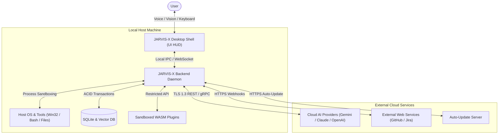

---

## 5. High-Level System Architecture Diagram

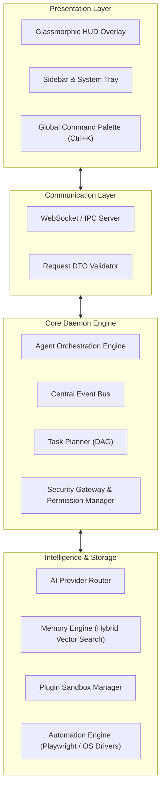

---

## 6. Component Architecture Diagram

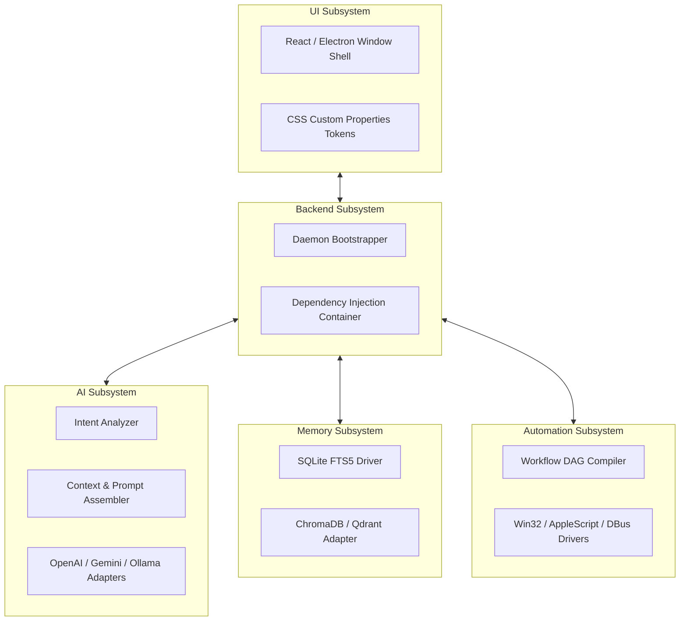

---

## 7. User Request Lifecycle Flowchart

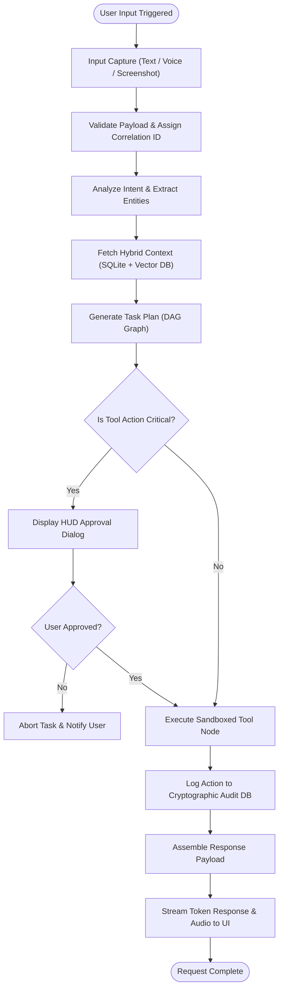

---

## 8. AI Brain Sequence Diagram

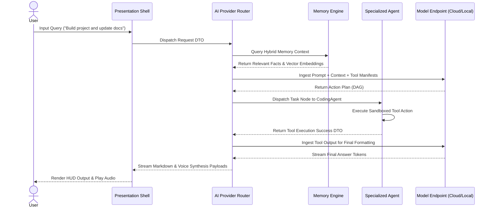

---

## 9. Memory Storage & Retrieval Flow Diagram

```mermaid
graph TD
    subgraph IngestionFlow ["Memory Ingestion"]
        NewFact["New User Fact / Session Event"] --> Classify["Classify Memory Type & Tags"]
        Classify --> Redact["Sanitize Passwords & PII"]
        Redact --> RelationalWrite["Write to SQLite Relation (FTS5)"]
        Redact --> VectorEmbed["Generate Vector Embedding"]
        VectorEmbed --> VectorWrite["Insert into ChromaDB HNSW Index"]
    end

    subgraph QueryFlow ["Memory Retrieval"]
        Query["AI Context Query"] --> HybridSearch["Hybrid Search Controller"]
        HybridSearch --> FTSQuery["SQLite Keyword Search"]
        HybridSearch --> VecQuery["Cosine Similarity Vector Search"]
        FTSQuery --> Ranker["Ranking Engine (Recency x Importance x Similarity)"]
        VecQuery --> Ranker
        Ranker --> Budget["Token Budgeting Filter (< 2048 Tokens)"]
        Budget --> ContextInject["Inject Markdown Block into System Prompt"]
    end
```

---

## 10. Multi-Agent Collaboration Diagram

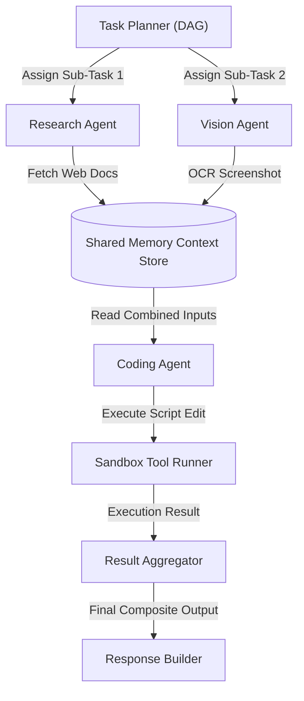

---

## 11. Plugin Architecture & Gateway Diagram

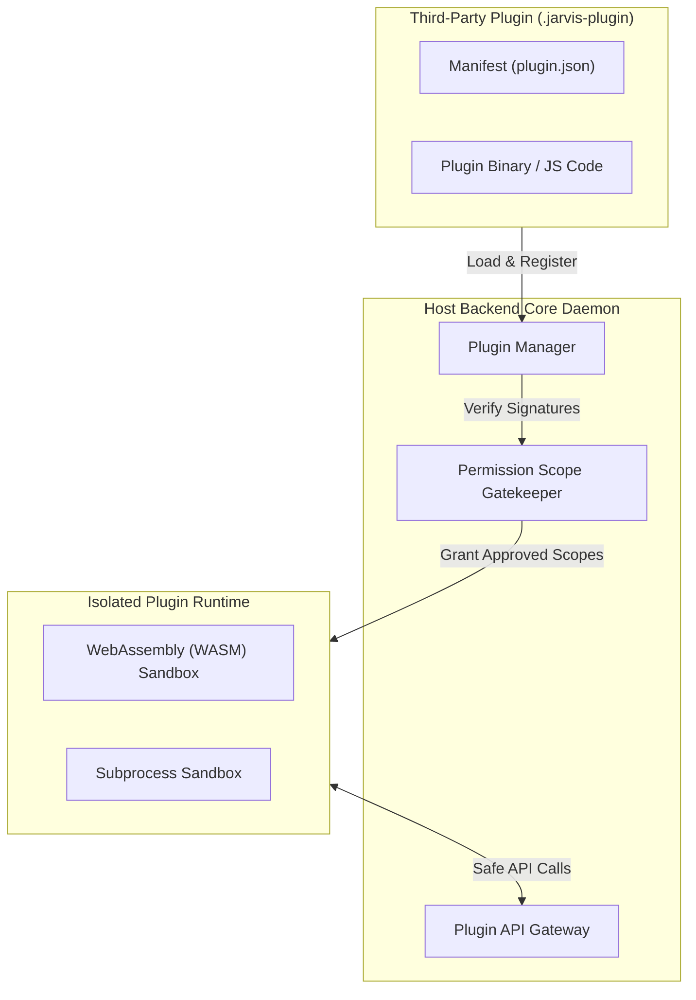

---

## 12. Automation Engine Workflow Diagram

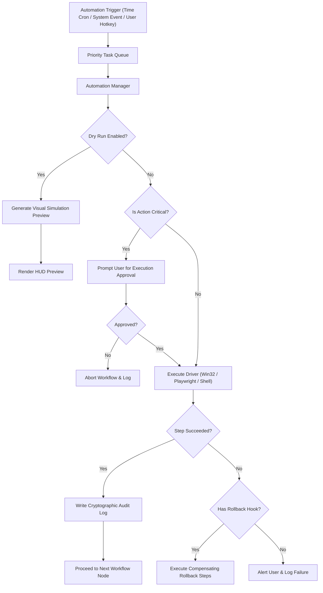

---

## 13. Database ER Diagram

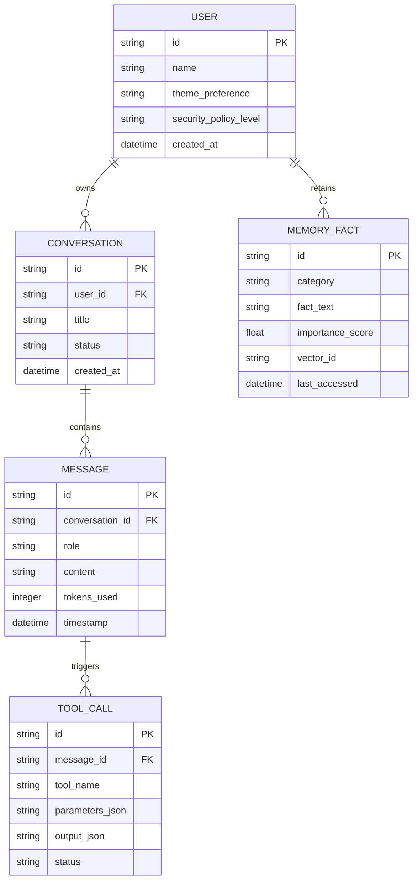

---

## 14. Deployment Architecture Diagram

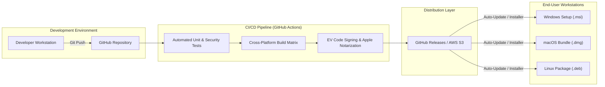

---

## 15. Security Architecture Diagram

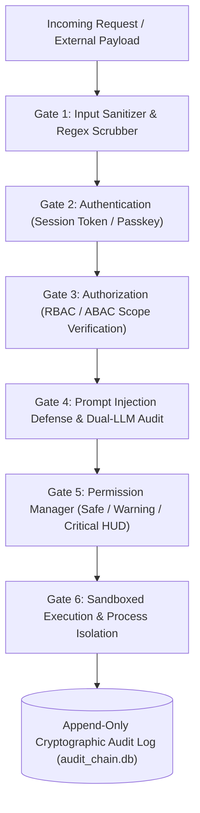

---

## 16. Diagram Maintenance Guidelines
*   **Version Control:** All diagrams must be written in standard Mermaid text syntax embedded within `/Specifications` markdown files.
*   **Naming Conventions:** Node IDs must use clear camelCase or PascalCase names; labels must be descriptive.
*   **Syntax Hygiene:** Special characters in labels must be enclosed inside double quotes (e.g., `id["Label (Info)"]`). HTML tags inside labels are strictly prohibited.
*   **Synchronization:** Any architectural change to core code interfaces, IPC protocols, or security gates requires an immediate corresponding update to this specification file.

---

## 17. Best Practices
1.  **Keep Diagrams Focused:** Limit individual diagrams to a single conceptual responsibility to maintain legibility.
2.  **Use Consistent Palette & Shapes:** Represent actors with rounded nodes `([User])`, databases with cylinder nodes `[(Database)]`, and decision points with diamond nodes `{"Decision?"}`.
3.  **Validate Syntax:** Verify all Mermaid diagrams compile cleanly using GitHub Markdown preview or Mermaid CLI before committing changes.

---

## 18. Acceptance Criteria
*   [ ] 100% of architectural subsystems possess explicit, compiling Mermaid diagrams.
*   [ ] All Mermaid nodes containing special characters use valid double-quote escaping.
*   [ ] Sequence and component diagrams accurately reflect current API and security gate contracts.
*   [ ] ER diagram accurately reflects the relational database SQLite schema definitions.

---

## 19. Conclusion
The System Diagrams Specification provides the master visual blueprint for JARVIS-X. By establishing standardized Mermaid flowcharts, sequence diagrams, component topologies, ER schemas, security validation gates, and deployment matrices, this document ensures that developers, architects, and open-source contributors maintain a shared visual understanding of the JARVIS-X AI Operating System throughout its lifecycle.
